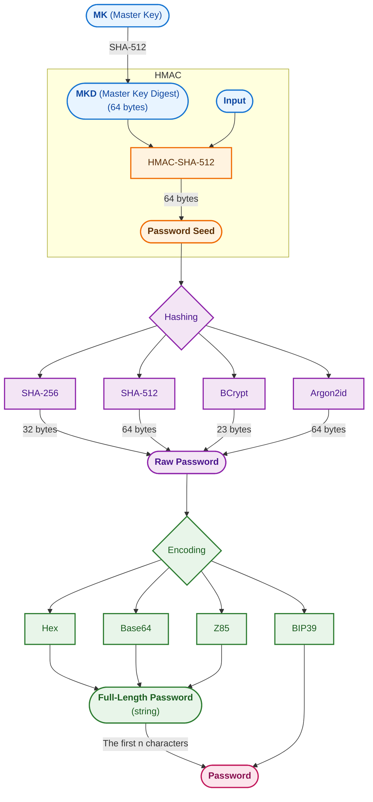

# 🔐 PassGen — Kotlin Multiplatform Deterministic Password Generator

[](https://kotlinlang.org/)
[](https://github.com/JetBrains/compose-multiplatform)
[-green.svg?style=flat)](#running-the-apps)

**PassGen** is a modern, secure, and fully decentralized deterministic password generator built with **Kotlin Multiplatform (KMP)** and **Compose Multiplatform**. It allows users to generate strong, cryptographically secure passwords deterministically across multiple platforms—Android, iOS, Desktop (JVM), and Web (Kotlin/Wasm & JS)—ensuring you can recreate your passwords anywhere without relying on cloud-synced credential vaults.

---

## 🚀 Key Features

*   **Deterministic Key Derivation (KDF):** Generate identical, ultra-secure passwords using a master key and specific input contexts (e.g., account name, service name).
*   **Fully Decentralized & Stateless:** No cloud synchronization or database requirements to retrieve passwords; your master key and generation configs are everything you need.
*   **Cross-Platform UI:** Beautiful, responsive UI built natively for Android, iOS, Desktop, and Web using **Compose Multiplatform** and Material 3 design systems.
*   **Industry-Standard Cryptography:** Support for advanced modern hashing algorithms (Argon2id, BCrypt, SHA-512, SHA-256) and flexible encoding encoders (Z85, Base64, Hex).
*   **Robust Modular Architecture:** Clean feature-based API/Implementation separation for high scalability, isolated testing, and codebase maintainability.
*   **Local Vaulting Optionality:** Safe local storage capability for account identifiers and metadata configuration presets with top-tier security access controls.

---

## 🛠 Cryptographic Password Generation Flow

The core generation mechanism utilizes a highly secure, multi-stage key derivation approach to map your master key and unique contextual input into a strong password string:




---

## 🏗 Modular Architecture Breakdown

PassGen is engineered with strict scalability rules following a feature-oriented and layered architecture pattern:

### Module Matrix & Responsibility

| Module / Component Layer | Description |
| :--- | :--- |
| **`:log-core`** | Central logging engine providing unified multi-platform logging hooks. |
| **`:codec`** | Lower-level binary encoding utilities implementing fast Hex, Base64, and Z85 encoders. |
| **`:hashing`** | Low-level cryptographic primitives isolating core implementations of SHA, BCrypt, and Argon2id. |
| **`:passwordGenerator`** | Pure Kotlin core domain handling deterministic generation, `KDFPassGen`, `TokenGen`, and secure random fallbacks. |
| **`:core:designsystem`** | Shared application theme, colors, fonts, shapes, and Atomic Design reusable design components. |
| **`:core:ui`** | Reusable high-level Compose components, structures, widgets, and animation canvases. |
| **`:core:domain`** | Framework-free layer containing rich use-cases (`GenerateKDFPassUseCase`, `SaveAccountUseCase`, etc.). |
| **`:core:data`** | Aggregates repositories and local state engines for configuration management and account profiles. |
| **`:core:model`** | Clean business and domain data model entities shared globally across features. |
| **`:feature:*:api`** | Contract interface definitions for features, isolating cross-feature dependencies. |
| **`:feature:*:impl`** | Concrete UI screens, ViewModels, business interaction workflows, and internal navigation rules. |
| **`:composeApp`** | Aggregated shared application Compose UI configuration layer. |
| **`:androidApp`** | Main entry-point launcher configuration and platform setup for Android. |
| **`:desktopApp`**| Main entry-point launcher setup and window target wrappers for Desktop (JVM). |
| **`:webApp`** | Compiled entry targets for both modern Wasm-JS browsers and heritage JS runtimes. |
| **`iosApp`** | Native Swift wrapper/Xcode project setting up layout entry frames hosting Compose Multiplatform. |

---

## 💻 Technical Stack & Custom Components

*   **Jetpack / Compose Multiplatform** (UI & layouts)
*   **Kotlin Coroutines & Flow** (Asynchronous stream computations & state propagation)
*   **Kotlinx Serialization** (Extensible binary and JSON serialization mechanics)
*   **KDF Core Engine:** Custom state-caching generation pipe leveraging specialized variable block bit expansion.

---

## 🚀 Building & Running the Applications

Ensure you have Android Studio Jellyfish (or newer), the Kotlin Multiplatform plugin, and Xcode installed (if compiling for iOS).

### Compilation Targets

Choose your target build platform via the IDE run widget configurations or use the native Gradle terminal tasks:

*   **Android Application:**
    ```bash
    ./gradlew :androidApp:assembleDebug
    ```
*   **Desktop Application (JVM):**
    *   *Hot Reload Dev Mode:* `./gradlew :desktopApp:hotRun --auto`
    *   *Standard Execution:* `./gradlew :desktopApp:run`
*   **Web Application:**
    *   *Wasm Target (Fast, modern browsers):* `./gradlew :webApp:wasmJsBrowserDevelopmentRun`
    *   *JS Target (Legacy browser support):* `./gradlew :webApp:jsBrowserDevelopmentRun`
*   **iOS Application:**
    *   Open the `/iosApp` directory folder inside **Xcode** and click the `Run` button or trigger via standard Xcode simulator command chains.

---

## 🧪 Testing Execution

PassGen emphasizes extreme correctness with thorough test suites verifying cryptographic determinism and UI behavior:

*   **All Local Unit Tests:** `./gradlew test`
*   **Android Instrumental Tests:** `./gradlew connectedAndroidTest`
*   **Desktop Unit Tests:** `./gradlew :passwordGenerator:jvmTest` (or target specific modules)
*   **Web Testing:**
    *   *Wasm Runtime:* `./gradlew :passwordGenerator:wasmJsTest`
    *   *JS Runtime:* `./gradlew :passwordGenerator:jsTest`
*   **iOS Simulation Tests:** `./gradlew :passwordGenerator:iosSimulatorArm64Test`

---

## 🔒 Security Principles & Compliance

PassGen enforces a **Zero-Knowledge Architecture**:
1.  **Memory Zeroing:** Raw master keys are stored only as long as necessary within transient memory blocks and are cleared immediately after background compute operations.
2.  **Stateless Trust:** Because passwords are generated dynamically on demand, there is no master credential database that malicious actors could exploit or extract from storage.
3.  **Local Encryption Only:** Any accessory configuration metadata (such as custom account tags or lengths) saved on device remains isolated in secure local vaults under platform-backed sandboxing frameworks.

---

## 📄 License & Contributions

Contributions to PassGen are highly encouraged! Please open an issue or submit a comprehensive pull request for any performance tuning or extra algorithm extensions.

*Licensed under the MIT License — see the project repository details.*
